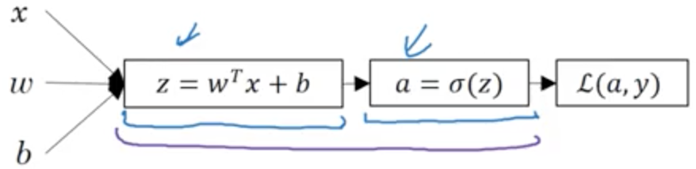
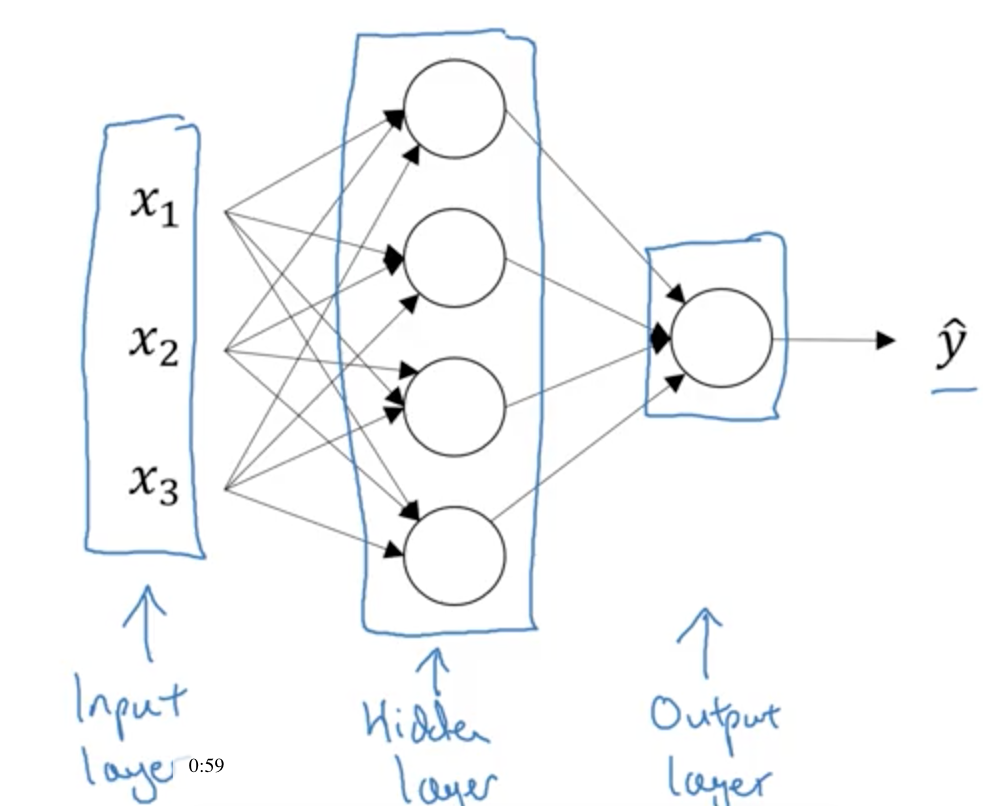

# Week 3 - Shallow Neural Networks

## Neural Network Overview
* In logistic regression, we found z and then used that to find the activation. Then, we used the activation to calculate the loss.
 
</img>
* In a neural network, we do the same thing but we do it multiple times. 
    * **Layer** - Each iteration of finding z and a. Layers are denoted by square brackets like so:  a[1]. 
    * After finding a and z a certain amount of times, we will then calculate the loss like in logistic regression.
    * Backward propagation is still used to find the derivatives for the network.

## Neural Network Representation
* What does a neural network look like?
 
</img>

* **Hidden layer** - These are values that are not seen within the training set. You see both the input and the output values, but the hidden layer values are not shown.
* Previously the input layer was referenced as x, but it can also be referenced as a[0]. Along those lines, the hidden layer becomes a[1], and the output layer becomes a[2].
* The neural network shown above is counted as 2-layer NN because the input layer is not counted as an actual layer.
* Both the hidden layer and outer layer have parameters associated with them.
    * Hidden layer parameters
        * w[1]
            * It’s in the shape of a (4, 3) vector.
            * The 4 comes from the fact that there are 4 nodes associated with the layer. The 3 comes from the 3 input layers.
        * b[1]
            * It’s in the shape of a (4, 1) matrix.
    * Output layer parameters
        * w[2]
            * It’s in the shape of a (1, 4) matrix.
            * The 4 here comes from the hidden layer’s 4 hidden units. The 1 comes from the single output unit.
        * b[2]
            * It’s in the shape of a (1, 1) matrix.

## Computing a Neural Network’s Output
* Now, let’s dive into what each node would look like in the hidden layer. As I wrote above, each node is used to calculate z and a.
 
</img>
* Example notation that illustrates what is happening looks like this: a2[1]
    * This annotates that we are looking at the second node in the first layer, or the hidden layer.
    * Subscript - the node number in the layer
    * Superscript - the layer number that you are working with
* Based on this, the z and a equations would both look a little different.
    * z2[1] = w2[1]Tx + b2[1]
* So, given x, you can solve this with four lines of code: 
<code>z[1] = W[1]x + b[1]</code> 
<code>a[1] = sigma(z[1])</code> 
<code>z[2] = W[2]a[1] + b[2]</code> 
<code>a[2] = sigma(z[2])</code> 

## Vectorizing Across Multiple Examples
* To vectorize across multiple training sets, we need to do the same thing for all the different sets.
* So if we have a set that is x1-xm, then we are going to generate a[2](i) as a solution. The first exponent tells us that we are in layer 2, and the second refers to which training set we are dealing with.
* Those four lines of code change a little. 
<code>for i = 1 to m:</code> 
	<code>  z[1](i) = W[I]x(i) + b[1]</code> 
	<code>  a[1](i) = sigmoid(z[1](i))</code> 
	<code>  z[2](i) = W[2]a[1](i) + b[2]</code> 
	<code>  a[2](i) = sigmoid(z[2](i))</code> 

* The solution above is not complete, however, because we still want to completely vectorize it. The way to do that is by using the capital version of the equation. ie. X = [x1, x2, xm]. Then you will have the full implementation. 
<code>Z[1] = W[1]X + b[1]</code> 
<code>A[1] = sigmoid(Z[1])</code> 
<code>Z[2] = W[2]A[1] + b[2]</code> 
<code>A[2] = sigmoid(Z[2])</code> 

## Activation Functions
* Up to this point we have only used the sigmoid function as an activation function but there are others that work better.
* The tanh function is an example of an activation function that almost always performs better than the sigmoid function. 
    * `a = tanh(z)`
        * It goes between 1 and -1 on the graph. The sigmoid function went between 1 and 0.
        * The equation: ez - e-z / ez + e-z.
        * This almost always works better than the sigmoid function because it “centers” your data around 0. This mean around 0 makes it easier for the computer to learn.
        * The one exception to this rule is when you are using binary classification because you actually want data that is between 0 and 1. So you would use the sigmoid activation function at the output layer.
* One other function that is popular is the ReLU function.
    * `a = max(0, z)`
        * When it’s positive, the derivative is 1. When it’s negative, the derivative is 0.
* **Leaky ReLU** - slight angle where the line is normally straight in the ReLU function. It’s usually more accurate than the ReLU function but it isn’t used in practice as much.
    * `a = max(0.01z, z)`
* Summary
    * If your output is a 0 or 1, the sigmoid function is good for the activation layer of the output.
    * The ReLU function is the favorite default as an activation function so if you aren’t sure which you should use, use it.
    * ReLU will be learned faster because the slope is much further away from zero, unlike other activation functions.

## Why do you need non-linear activation functions?
* **Linear activation function** or **identity activation function** - `g(z) = z`
    * What would happen if we just got rid of the g in the activation functions?
        * If you do this, it will just calculate the linear activation function of the inputs.
        * A linear hidden layer is more or less useless because the computation is basically the same as logistic regression.
    * The only time you may want to use linear activation functions is if you are trying to predict real numbers (say the price of homes) and your output needs to be a real number. You would use that activation function on the output layer.
        * The hidden layer will still need to use a different activation function.
        * You could still use a ReLU function to find the output in the real estate case.

## Derivatives of Activation Functions
* When doing back propagation, you need to be able to compute the derivative of the activation function.
* Sigmoid activation function
    * `d/dz*g(z)` which is otherwise known as g’z = a(1-a)
    * The plus for the g’ function is that if you have already calculated the a then you can very easily find out what the derivative of the function is.
* Tanh activation function
    * g’z = 1 - (tanh(z))2
* ReLU
    * g’z = 0 if z<0, 1 if z>=0
* Leaky ReLU
    * g’z = 0.01 if z<0, 1 if z>=0

## Gradient Descent for Neural Networks
* Parameters: w[1], b[1], w[2], b[2]
* Cost function: J(W[1], b[1], W[2], b[2]) = 1/m * np.sum(y&#770;, y). 
    * y&#770; also means a[2]

* Forward Propagation Step 
<code>Z[1] = W[1]X + b[1]</code> 
<code>A[1] = g[1](Z[1])</code> 
<code>Z[2] = W[2]A[1] + b[2]</code> 
<code>A[2] = g[2](Z[2]) = sigmoid(Z[2])</code> 
* Backward Propagation Step 
<code>dZ[2] = A[2] - Y</code> 
<code>dW[2] = 1/m * dZ[2]A[2]T</code> 
<code>db[2] = 1/m * np.sum(dZ[2], axis = 1, keepdims = True)</code> 
<code>dZ[1] = W[2]TdZ[2] * g[1]’(Z[1])</code> 
<code>dW[1] = 1/m * dZ[1]XT</code> 
<code>db[1] = a/m * np.sum(dZ[1], axis = 1, keepdims = True)</code> 

## Random Initialization
* In neural networks, it is important that you initialize weights as random numbers.
* If all the hidden layer nodes are initialized to zero then they will be symmetrical and they will never differ from one another. In other words, it would become pointless to have more than one node. 
<code>w[1] = np.random.randn(2, 2) * 0.01</code> 
<code>b[1] = np.zeros((2, 1))</code> 
<code>w[2] = np.random.randn(2, 2) * 0.01</code> 
<code>b[2] = np.zeros((2, 1))</code> 
* When training with more hidden layers, and having more of a deep neural network, you oftentimes won’t want to use the constant 0.01. For one hidden layer, it is fine.

### Additional Resources
* http://scs.ryerson.ca/~aharley/neural-networks/
* https://cs231n.github.io/neural-networks-case-study/